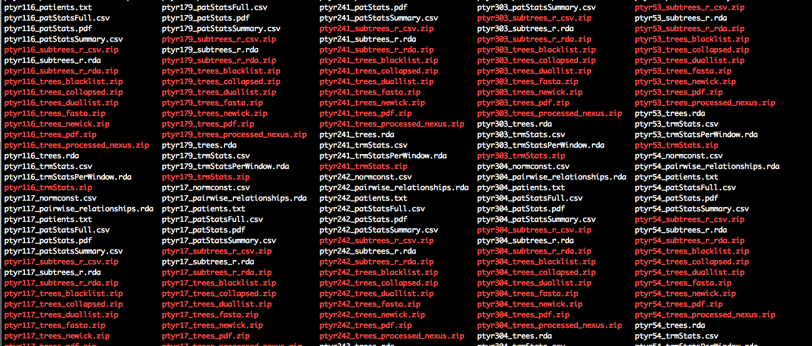

```{r setup, include = FALSE}
knitr::opts_chunk$set(
  collapse = TRUE,
  comment = "#>"
)
```

## Introduction
This tutorial describes the steps to infer phylogenetic relationships from a
large number of deep-sequence phylogenies of individuals in the same potential
transmission network. The main objective is to illustrate how large numbers of
phyloscanner runs can be generated and run in parallel with the utility
functions in this software package, without too much computational overhead. 

The tutorial assumes that *phyloscanner_make_trees.py* was already run to
generate read alignments and deep-sequence phylogenies for individuals in the
same potential transmission network. For the demo analysis of data from the
Rakai population-based sample of 2,652 infected individuals, these data are
provided in Data Set S1.  

## Setting up the analysis
Start by extracting Dataset S1 from the command line, assuming that it was
copied into a data folder called 'RakaiPopSample_data':
```bash
cd /Users/Oliver/sandbox/DeepSeqProjects
mkdir RakaiPopSample_deepseqtrees
tar -xvf RakaiPopSample_data/Dataset_S1.tar -C RakaiPopSample_deepseqtrees
```
The new directory should contain files that look as follows:

<p align="center"></p>

1. Each analysis of a potential transmission network is identified with the
   prefix `ptyrX_` where `X` is an integer. Note that, to minimise computations,
   individuals in small transmission networks can be grouped into a single
   *phyloscanner* analysis, which we call a *batch* in this tutorial. In total, there are 345 batches.
2. Two files are available for each batch. First, a text file listing all
   individuals in the batch, in file `ptyrX_patients.txt`. 
3. Second, deep-sequence phylogenies of reads from individuals in the same batch, 
    generated from overlapping read alignments across the genome, 
    in file `ptyrX_trees_newick.zip`. You can unzip the trees to see the coordinates of the genomic windows 
    for which deep-sequence trees could be generated, but make sure you leave the zip
    files in the directory.    

Next, open R and define the base directories for your project: 
```{r, include=TRUE, eval=FALSE, echo=TRUE, tidy=TRUE}
require(Phyloscanner.R.utilities)
HOME		<- '~/sandbox/DeepSeqProjects'								
in.dir		<- file.path(HOME,'RakaiPopSample_deepseqtrees')	
out.dir		<- file.path(HOME,"RakaiPopSample_phyloscanner_out")
work.dir	<- file.path(HOME,"RakaiPopSample_phyloscanner_work")				
prog.pty	<- '/Users/Oliver/git/phylotypes/phyloscanner_make_trees.py'
dir.create(out.dir, showWarnings=FALSE)
dir.create(work.dir, showWarnings=FALSE)
```
Here, `prog.pty` is the full path to the *phyloscanner*
program *phyloscanner_make_trees.py* and `work.dir` is the name of temporary
directory.

## Prepare bash scripts to run phyloscanner
The next step is to define the input arguments to *phyloscanner*. Please see the
*phyloscanner* manual for details. The default arguments that were used for
analysis of the Rakai population-based sample are as follows. 
```{r, include=TRUE, eval=FALSE, echo=TRUE, tidy=TRUE}
pty.args <- list(	prog.pty=prog.pty, 
		prog.mafft=NA, 
		prog.raxml=NA, 
		data.dir=NA, 
		work.dir=work.dir, 
		out.dir=out.dir, 
		alignments.file=system.file(package="Phyloscanner.R.utilities", "HIV1_compendium_AD_B_CPX_v2.fasta"),
		alignments.root='REF_CPX_AF460972', 
		alignments.pairwise.to='REF_B_K03455',
		bl.normalising.reference.file=system.file(package="Phyloscanner.R.utilities", "data", "hiv.hxb2.norm.constants.rda"),
		bl.normalising.reference.var='MEDIAN_PWD',														
		window.automatic= '', 
		merge.threshold=0, 
		min.read.count=1, 
		quality.trim.ends=23, 
		min.internal.quality=23, 
		merge.paired.reads=TRUE, 
		no.trees=FALSE, 
		dont.check.duplicates=FALSE,
		dont.check.recombination=TRUE,
		num.bootstraps=1,
		all.bootstrap.trees=TRUE,
		strip.max.len=350, 
		min.ureads.individual=NA, 
		win=c(800,9400,25,250), 				
		keep.overhangs=FALSE,
		use.blacklisters=c('ParsimonyBasedBlacklister','DownsampleReads'),
		tip.regex='^(.*)_fq[0-9]+_read_([0-9]+)_count_([0-9]+)$',
		roguesubtree.kParam=20,
		roguesubtree.prop.threshold=0,
		roguesubtree.read.threshold=20,
		dwns.maxReadsPerPatient=50,	
		multifurcation.threshold=1e-5,
		split.rule='s',
		split.kParam=20,
		split.proximityThreshold=0,
		split.readCountsMatterOnZeroBranches=TRUE,
		split.pruneBlacklist=FALSE,
		trms.allowMultiTrans=TRUE,
		pw.trmw.min.reads=30,									
		pw.trmw.min.tips=1,
		pw.trmw.close.brl=0.025,
		pw.trmw.distant.brl=0.05,
		pw.prior.keff=2,
		pw.prior.neff=3,
		pw.prior.keff.dir=2,
		pw.prior.neff.dir=3,				
		pw.prior.calibrated.prob=0.66,
		mem.save=0,
		verbose=TRUE,				
		select=NA 
)	
save(pty.args, file=file.path(out.dir, 'pty.args.rda'))
```

Next, we will prepare UNIX *bash* scripts to run a large number of
*phyloscanner* analyses on a population-based sample. Each *bash* script
corresponds to the deep-sequence phylogenetic analysis of one batch of
individuals that are analysed jointly.

For each batch of individuals to be processed, find the corresponding list of
patients in the input directory: 
```{r, include=TRUE, eval=FALSE, echo=TRUE, tidy=TRUE}
pty.c	<- data.table(FILE_PAT=list.files(in.dir, pattern='_patients.txt', full.names=TRUE))
pty.c[, PTY_RUN:= as.integer(gsub('ptyr','',gsub('_patients.txt','',basename(FILE_PAT))))]
```

Check which (if any) batches have already been processed, and remove them from
the TODO list:
```{r, include=TRUE, eval=FALSE, echo=TRUE, tidy=TRUE}
tmp <- data.table(FILE_TRMW=list.files(out.dir, pattern='_pairwise_relationships.rda', full.names=TRUE))
tmp[, PTY_RUN:= as.integer(gsub('ptyr','',gsub('_pairwise_relationships.rda','',basename(FILE_TRMW))))]
pty.c <- merge(pty.c, tmp, by='PTY_RUN', all.x=1)
pty.c <- subset(pty.c, is.na(FILE_TRMW))
```

For each batch of individuals, create a UNIX *bash* script to run
*phyloscanner*: 
```{r, include=TRUE, eval=FALSE, echo=TRUE, tidy=TRUE}
setkey(pty.c, PTY_RUN)		
pty.c	<- pty.c[, { 
		prefix.infiles <- gsub('patients.txt','',FILE_PAT)			
		cmd <- phsc.cmd.phyloscanner.one.resume(prefix.infiles, pty.args)
		list(CMD=cmd) 
	}, by='PTY_RUN']	
```

Each bash script should look similar to this:
```{r, include=TRUE, eval=FALSE, echo=TRUE, tidy=TRUE}
pty.c[1,cat(CMD)]		
```
```bash		
CWD=$(pwd)
echo $CWD
mkdir -p "$CWD/pty_18-10-19-15-43-41"
cp "/Users/Oliver/sandbox/DeepSeqProjects/RakaiPopSample_deepseqtrees/ptyr2_patients.txt" "$CWD/pty_18-10-19-15-43-41"
unzip "/Users/Oliver/sandbox/DeepSeqProjects/RakaiPopSample_deepseqtrees/ptyr2_trees_fasta.zip" -d "$CWD/pty_18-10-19-15-43-41"
unzip "/Users/Oliver/sandbox/DeepSeqProjects/RakaiPopSample_deepseqtrees/ptyr2_trees_newick.zip" -d "$CWD/pty_18-10-19-15-43-41"
cd "$CWD/pty_18-10-19-15-43-41"
Rscript /Users/Oliver/git/phylotypes/deprecated/NormalisationLookupWriter.R --scriptdir /Users/Oliver/git/phylotypes/deprecated "$CWD/pty_18-10-19-15-43-41/ptyr2_InWindow_" "/Users/Oliver/Library/R/3.3/library/Phyloscanner.R.utilities/data/hiv.hxb2.norm.constants.rda" "$CWD/pty_18-10-19-15-43-41/ptyr2_normconst.csv" "MEDIAN_PWD"  --standardize
Rscript /Users/Oliver/git/phylotypes/tools/parsimony_based_blacklister.R 20 0 20 "$CWD/pty_18-10-19-15-43-41/ptyr2_InWindow_" "$CWD/pty_18-10-19-15-43-41/ptyr2_blacklistsank_InWindow" --dualsOutputFile "$CWD/pty_18-10-19-15-43-41/ptyr2_duallistsank_InWindow" --outgroupName REF_CPX_AF460972 --tipRegex "^(.*)_fq[0-9]+_read_([0-9]+)_count_([0-9]+)$" --multifurcationThreshold 1e-05  --branchLengthNormalisation "$CWD/pty_18-10-19-15-43-41/ptyr2_normconst.csv" --verbose
Rscript /Users/Oliver/git/phylotypes/tools/downsample_reads.R 50 $CWD/pty_18-10-19-15-43-41/ptyr2_ $CWD/pty_18-10-19-15-43-41/ptyr2_blacklistdwns_ --blacklist $CWD/pty_18-10-19-15-43-41/ptyr2_blacklistsank_InWindow_ --tipRegex "^(.*)_fq[0-9]+_read_([0-9]+)_count_([0-9]+)$" --seed 42 --verbose
Rscript /Users/Oliver/git/phylotypes/tools/split_hosts_to_subgraphs.R "$CWD/pty_18-10-19-15-43-41/ptyr2_" "ptyr2" --blacklist "$CWD/pty_18-10-19-15-43-41/ptyr2_blacklistdwns_" --outputdir "$CWD/pty_18-10-19-15-43-41" --idFile "$CWD/pty_18-10-19-15-43-41/ptyr2_patients.txt" --outgroupName REF_CPX_AF460972 --splitsRule s --kParam 20 --proximityThreshold 0 --readCountsMatterOnZeroBranches --tipRegex "^(.*)_fq[0-9]+_read_([0-9]+)_count_([0-9]+)$" --multifurcationThreshold 1e-05 --branchLengthNormalisation "$CWD/pty_18-10-19-15-43-41/ptyr2_normconst.csv" --outputAsRDA --pdfwidth 30 --pdfrelheight 0.15 --verbose
Rscript /Users/Oliver/git/phylotypes/tools/classify_relationships.R "$CWD/pty_18-10-19-15-43-41/ProcessedTree_s_ptyr2_" "$CWD/pty_18-10-19-15-43-41/subgraphs_s_ptyr2_" "$CWD/pty_18-10-19-15-43-41/ptyr2" --branchLengthNormalisation "$CWD/pty_18-10-19-15-43-41/ptyr2_normconst.csv" --verbose
Rscript /Users/Oliver/git/phylotypes/tools/summary_statistics.R --scriptDir /Users/Oliver/git/phylotypes/tools "$CWD/pty_18-10-19-15-43-41/ptyr2_patients.txt" "$CWD/pty_18-10-19-15-43-41/ProcessedTree_s_ptyr2_InWindow_" "$CWD/pty_18-10-19-15-43-41/subgraphs_s_ptyr2_InWindow_" "$CWD/pty_18-10-19-15-43-41/ptyr2_" --tipRegex "^(.*)_fq[0-9]+_read_([0-9]+)_count_([0-9]+)$" --blacklists "$CWD/pty_18-10-19-15-43-41/ptyr2_blacklistdwns_InWindow_" --verbose
Rscript /Users/Oliver/git/phylotypes/deprecated/TransmissionSummary.R "$CWD/pty_18-10-19-15-43-41/ptyr2_patients.txt" "$CWD/pty_18-10-19-15-43-41/ptyr2_classification_InWindow_" "$CWD/pty_18-10-19-15-43-41/ptyr2_trmStats.csv" --scriptdir /Users/Oliver/git/phylotypes/deprecated --summaryFile "$CWD/pty_18-10-19-15-43-41/ptyr2_patStatsFull.csv" --minThreshold 1 --detailedOutput "$CWD/pty_18-10-19-15-43-41/ptyr2_trmStatsPerWindow.rda" --allowMultiTrans --verbose
Rscript /Users/Oliver/Library/R/3.3/library/Phyloscanner.R.utilities/phsc.pairwise.relationships.Rscript --infile "$CWD/pty_18-10-19-15-43-41/ptyr2_trmStatsPerWindow.rda" --outfile "$CWD/pty_18-10-19-15-43-41/ptyr2_pairwise_relationships.rda" --trmw.min.reads 30 --trmw.min.tips 1 --trmw.close.brl 0.025 --trmw.distant.brl 0.05 --prior.keff 2 --prior.neff 3 --prior.keff.dir 2 --prior.neff.dir 3 --prior.calibrated.prob 0.66 --rel.likely.pair --rel.likely.pair.by.distance.only --rel.likely.pair.by.topology.only --rel.likely.pair.by.cross.table --rel.direction --rel.chain
Rscript /Users/Oliver/Library/R/3.3/library/Phyloscanner.R.utilities/phsc.read.processed.phyloscanner.output.in.directory.Rscript --prefix.infiles "$CWD/pty_18-10-19-15-43-41/ptyr2_" --save.file.base "$CWD/pty_18-10-19-15-43-41/ptyr2_" --read.likelytransmissions --read.trees --read.subtrees --zip
mv ptyr2* "~/sandbox/DeepSeqProjects/RakaiPopSample_phyloscanner_out"
for file in *; do
	zip -ur9XTj ptyr2_otherstuff.zip "$file"
done
mv ptyr2_otherstuff.zip "~/sandbox/DeepSeqProjects/RakaiPopSample_phyloscanner_out"
cd $CWD
rm -r "$CWD/pty_18-10-19-15-43-41"	
```
	
## Run bash scripts (option 1)
Each *bash* script can be run from a UNIX terminal, we only have to
write the scripts to file. This following code will write each script to the
temp directory that you specified above, to a file named
`phsc.Wed_Oct_17_101858_2018.sh` or similar: 
```{r, include=TRUE, eval=FALSE, echo=TRUE, tidy=TRUE}
invisible(pty.c[,	{					
		outfile <- gsub(':','',paste("phsc",paste(strsplit(date(),split=' ')[[1]],collapse='_',sep=''),'sh',sep='.'))
		outfile <- file.path(pty.args[['work.dir']], outfile)
		cat(CMD, file=outfile)
		Sys.chmod(outfile, mode="777")
		Sys.sleep(1)
	}, by='PTY_RUN'])					
```
Each file can be run on a UNIX terminal, e.g.:
```r
cd /Users/Oliver/Dropbox (SPH Imperial College)/2015_PANGEA_DualPairsFromFastQIVA/RakaiPopSample_phyloscanner_work
phsc.Wed_Oct_17_101858_2018.sh 	
```	

## Run bash scripts (option 2)

Alternatively, the bash scripts can be processed on a high performance
environment with a job scheduling system. We first define a PBS header for the
job scheduling system, add the header to each script, and then submit each
script to the job scheduling system. The exact form of the PBS header depends
on your job scheduler, below is an example that works at Imperial.

```{r, include=TRUE, eval=FALSE, echo=TRUE, tidy=TRUE}
hpc.load <- "module load R/3.3.3"			# make R available 
hpc.select <- 1						# number of nodes
hpc.nproc <- 1						# number of processors on node
hpc.walltime <- 15					# walltime
hpc.q <- "pqeelab"					# PBS queue
hpc.mem <- "6gb" 					# RAM
pbshead	<- "#!/bin/sh"
tmp <- paste("#PBS -l walltime=", hpc.walltime, ":59:59,pcput=", hpc.walltime, ":45:00", sep = "")
pbshead	<- paste(pbshead, tmp, sep = "\n")
tmp <- paste("#PBS -l select=", hpc.select, ":ncpus=", hpc.nproc,":mem=", hpc.mem, sep = "")
pbshead <- paste(pbshead, tmp, sep = "\n")
pbshead <- paste(pbshead, "#PBS -j oe", sep = "\n")
pbshead <- paste(pbshead, paste("#PBS -q", hpc.q), sep = "\n")
pbshead <- paste(pbshead, hpc.load, sep = "\n")
```

Our header thus looks as follows:	
```bash
#!/bin/sh 
#PBS -l walltime=15:59:59,pcput=15:45:00 
#PBS -l select=1:ncpus=1:mem=6gb 
#PBS -j oe 
#PBS -q pqeelab 
module load R/3.3.3
```
	
We are now ready to add the header to each script, and submit the job:		
```{r, include=TRUE, eval=FALSE, echo=TRUE, tidy=TRUE}
invisible(pty.c[,	{					
		cmd <- paste(pbshead,'cd $TMPDIR',sep='\n')
		cmd <- paste(cmd,CMD,sep='\n')	
		outfile <- gsub(':','',paste("phsc",paste(strsplit(date(),split=' ')[[1]],collapse='_',sep=''),'sh',sep='.'))
		outfile <- file.path(pty.args[['work.dir']], outfile)
		cat(CMD, file=outfile)
		cmd <- paste("qsub", outfile)
		cat(cmd)
		cat(system(cmd, intern= TRUE))
		Sys.sleep(1)						
	}, by='PTY_RUN'])
```

## Expected *phyloscanner* output
Once all scripts are run, the output directory contains for each batch a number
of files, of which the files called `ptyrX_pairwise_relationships.rda`
are used for reconstructing HIV-1 transmission networks from the
population-based sample.

Below is a description of the full output. 

1. `ptyrX_patients.txt` Input file, list of individuals in this batch.
2. `ptyrX_trees_newick.zip` Input file, deep sequence trees.
3. `ptyrX_pairwise_relationships.rda` Main output file for
   reconstructing HIV-1 transmission networks.     
4. `ptyrX_normconst.csv` File containing multipliers used to standardise branch
   lengths of each deep-sequence phylogeny.
5. `ptyrX_trees.rda` Deep-sequence phylogenies in *ape* format, annotated with
   subgraphs of each individual.
6. `ptyrX_trees_processed_nexus.zip` Deep-sequence phylogenies in *nexus*
   format, annotated with subgraphs of each individual. 
7. `ptyrX_trees_collapsed.zip` Collaposed deep-sequence phylogenies, with all
   blacklisted taxa removed.
8. `ptyrX_trees_pdf.zip` PDFs of the deep-sequence phylogenies.
9. `ptyrX_patStatsFull.csv` Detailed description of subgraphs of all
    individuals in this batch across the genome.
10. `ptyrX_patStatsSummary.csv` Summary description of subgraphs of all
    individuals in this batch across the genome. 
11. `ptyrX_patStats.pdf` PDFs visualising properties of the subgraphs of all
    individuals in this batch across the genome. 
12. `ptyrX_trmStats.zip` Detailed description of pairwise phylogenetic
    relationships of all individuals in this batch across the genome, in *csv*
    format.
13. `ptyrX_trmStatsPerWindow.rda` Detailed description of pairwise phylogenetic
    relationships of all individuals in this batch across the genome, in *R*
    format.
14. `ptyrX_trmStats.csv` Summary description of pairwise phylogenetic
    relationships of all individuals in this batch across the genome.
15. `ptyrX_subtrees_r_csv.zip` Detailed description of subgraphs of all
    individuals in this batch across the genome, in *csv* format.
16. `ptyrX_subtrees_r_rda.zip` Detailed description of subgraphs of all
    individuals in this batch across the genome, in *R* format.   
17. `ptyrX_trees_blacklist.zip` Names of blacklisted taxa of all individuals in
    this batch.
18. `ptyrX_trees_duallist.zip` Names of potential contaminants of all
    individuals in this batch.   

Once all scripts are run, the output directory should have a file structure
similar to that shown here:
<p align="center"></p>