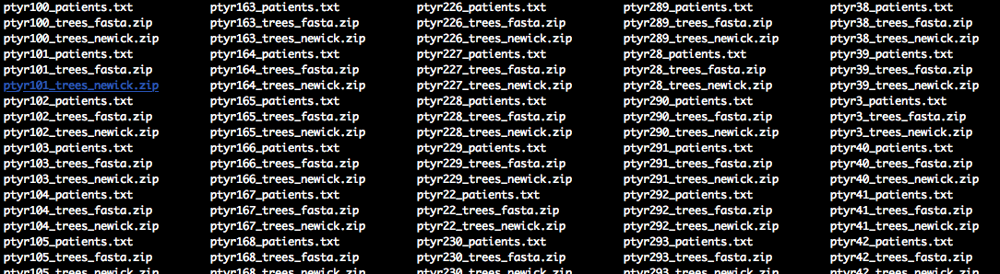

# Perform *phyloscanner* analysis on deep-sequence trees from a population-based sample

## Introduction: stage 1 and 2 of population-level analysis
It is computationally challenging to reconstruct viral trees from all
deep-sequence reads of hundreds or thousands of individuals. To
address this challenge, we proceed in two stages. 

In a first stage, we divide a large population-based sample into groups of 50
to 75 individuals, and then run *phyloscanner* on all possible pairs of groups
to generate read alignments and deep-sequence phylogenies. From this trees, we
identified potentially phylogenetically close pairs and, from those, networks of
pairs that were connected through at least one common, phylogenetically close
individual. Networks were extended to include spouses of partners in networks,
couples in no network, and the ten most closely related individuals from stage 1
as controls. 

In a second stage, analyses are repeated on all individuals that together form
a potential transmission network. This step allows us to resolve the ordering of
transmission events within transmission networks, and to confirm potential
transmission pairs within a network. 

## Introduction: generate trees, then infer phylogenetic relationships
Both stages 1 and 2 consist of very similar steps. First, deep-sequence trees
are generated, and thereafter phylogenetic relationships between individuals
are estimated. 

**This tutorial describes the steps to infer phylogenetic
relationships from a large number of deep-sequence phylogenies of individuals in
the same potential transmission network (stage 2).**  

The code below assumes that *phyloscanner_make_trees.py* was already run to
generate read alignments and deep-sequence phylogenies for individuals in the
same potential transmission network (see here); and that output from this step
is available in the following file structure.
1. Each analysis of a potential transmission network is identified with the
   prefix `ptyrX_` where `X` is an integer. Note that, to minimise computations,
   individuals in small transmission networks can be grouped into a single
   *phyloscanner* analysis, which we call a *batch* in this tutorial. 
2. Three files are available for each batch. First, a text file listing all
   individuals in the batch, in file `ptyrX_patients.txt`. 
3. Second, the read alignments generated with *phyloscanner*, zipped into file
   `ptyrX_trees_fasta.zip`. 
4. Third, the deep-sequence phylogenies generated with *phyloscanner*, zipped
   into file `ptyrX_trees_newick.zip`. 

Data Set S1 contains these files for 345 batches of individuals of the Rakai
population-based sample, that comprise 1,426 potential transmission pairs and
closely related control sequences.

## Setting up the analysis
Start by defining the base directories for your project: 
1. `HOME` Base directory.
2. `in.dir` Name of directory containing read alignments and deep-sequence
   trees, which can be generated from *bam* files with *phyloscanner*. If you
   would like to start with Data Set S1, you should unzip files in Data Set S1
   to this directory.
3. `out.dir` Name of output directory.
4. `work.dir` Name of temp directory.
5. `prog.pty` Full path to the *phyloscanner* program
   *phyloscanner_make_trees.py*
    
For example:    
```r 
require(Phyloscanner.R.utilities)

HOME		<- '/Users/Oliver/Dropbox (SPH Imperial College)/2015_PANGEA_DualPairsFromFastQIVA'								
in.dir		<- file.path(HOME,'RakaiPopSample_deepseqtrees')	
out.dir		<- file.path(HOME,"RakaiPopSample_phyloscanner_out")
work.dir	<- file.path(HOME,"RakaiPopSample_phyloscanner_work")				
prog.pty	<- '/Users/Oliver/git/phylotypes/phyloscanner_make_trees.py'

# create directories if they dont exist
dir.create(out.dir, showWarnings=FALSE)
dir.create(work.dir, showWarnings=FALSE)
```  

The input directory should have a file structure similar to this (just unzip
Data Set S1): 

<p align="center"></p>

## Prepare bash scripts to run phyloscanner
The next step is to define the input arguments to *phyloscanner*. Please see the
*phyloscanner* manual for details. The default arguments that were used for
analysis of the Rakai population-based sample are as follows. 
```r 
pty.args <- list(	prog.pty=prog.pty, 
		prog.mafft=NA, 
		prog.raxml=NA, 
		data.dir=NA, 
		work.dir=work.dir, 
		out.dir=out.dir, 
		alignments.file=system.file(package="Phyloscanner.R.utilities", "HIV1_compendium_AD_B_CPX_v2.fasta"),
		alignments.root='REF_CPX_AF460972', 
		alignments.pairwise.to='REF_B_K03455',
		bl.normalising.reference.file=system.file(package="Phyloscanner.R.utilities", "data", "hiv.hxb2.norm.constants.rda"),
		bl.normalising.reference.var='MEDIAN_PWD',														
		window.automatic= '', 
		merge.threshold=0, 
		min.read.count=1, 
		quality.trim.ends=23, 
		min.internal.quality=23, 
		merge.paired.reads=TRUE, 
		no.trees=FALSE, 
		dont.check.duplicates=FALSE,
		dont.check.recombination=TRUE,
		num.bootstraps=1,
		all.bootstrap.trees=TRUE,
		strip.max.len=350, 
		min.ureads.individual=NA, 
		win=c(800,9400,25,250), 				
		keep.overhangs=FALSE,
		use.blacklisters=c('ParsimonyBasedBlacklister','DownsampleReads'),
		tip.regex='^(.*)_fq[0-9]+_read_([0-9]+)_count_([0-9]+)$',
		roguesubtree.kParam=20,
		roguesubtree.prop.threshold=0,
		roguesubtree.read.threshold=20,
		dwns.maxReadsPerPatient=50,	
		multifurcation.threshold=1e-5,
		split.rule='s',
		split.kParam=20,
		split.proximityThreshold=0,
		split.readCountsMatterOnZeroBranches=TRUE,
		split.pruneBlacklist=FALSE,
		trms.allowMultiTrans=TRUE,
		pw.trmw.min.reads=30,									
		pw.trmw.min.tips=1,
		pw.trmw.close.brl=0.025,
		pw.trmw.distant.brl=0.05,
		pw.prior.keff=2,
		pw.prior.neff=3,
		pw.prior.keff.dir=2,
		pw.prior.neff.dir=3,				
		pw.prior.calibrated.prob=0.66,
		mem.save=0,
		verbose=TRUE,				
		select=NA 
)	
save(pty.args, file=file.path(out.dir, 'pty.args.rda'))
```

Next, we will prepare UNIX *bash* scripts to run a large number of
*phyloscanner* analyses on a population-based sample. Each *bash* script
corresponds to the deep-sequence phylogenetic analysis of one batch of
individuals that are analysed jointly.

For each batch of individuals to be processed, find the corresponding list of
patients in the input directory: 
```r
pty.c	<- data.table(FILE_PAT=list.files(in.dir, pattern='_patients.txt', full.names=TRUE))
pty.c[, PTY_RUN:= as.integer(gsub('ptyr','',gsub('_patients.txt','',basename(FILE_PAT))))]
```

Check which (if any) batches have already been processed, and remove them from
the TODO list:
```r
tmp <- data.table(FILE_TRMW=list.files(out.dir, pattern='_pairwise_relationships.rda', full.names=TRUE))
tmp[, PTY_RUN:= as.integer(gsub('ptyr','',gsub('_pairwise_relationships.rda','',basename(FILE_TRMW))))]
pty.c <- merge(pty.c, tmp, by='PTY_RUN', all.x=1)
pty.c <- subset(pty.c, is.na(FILE_TRMW))
```

For each batch of individuals, create a UNIX *bash* script to run
*phyloscanner*: 
```r
setkey(pty.c, PTY_RUN)		
pty.c	<- pty.c[, { 
		prefix.infiles <- gsub('patients.txt','',FILE_PAT)			
		cmd <- phsc.cmd.phyloscanner.one.resume(prefix.infiles, pty.args)
		list(CMD=cmd) 
	}, by='PTY_RUN']		
pty.c[1,cat(CMD)]		
```

Each bash script should look similar to this:
```r
pty.c[1,cat(CMD)]		
```
```bash		
CWD=$(pwd)
echo $CWD
mkdir -p "$CWD/pty_18-10-17-10-03-47"
cp "/Users/Oliver/Dropbox (SPH Imperial College)/2015_PANGEA_DualPairsFromFastQIVA/RakaiPopSample_deepseqtrees/ptyr223_patients.txt" "$CWD/pty_18-10-17-10-03-47"
unzip "/Users/Oliver/Dropbox (SPH Imperial College)/2015_PANGEA_DualPairsFromFastQIVA/RakaiPopSample_deepseqtrees/ptyr223_trees_fasta.zip" -d "$CWD/pty_18-10-17-10-03-47"
unzip "/Users/Oliver/Dropbox (SPH Imperial College)/2015_PANGEA_DualPairsFromFastQIVA/RakaiPopSample_deepseqtrees/ptyr223_trees_newick.zip" -d "$CWD/pty_18-10-17-10-03-47"
cd "$CWD/pty_18-10-17-10-03-47"
Rscript /Users/Oliver/git/phylotypes/deprecated/NormalisationLookupWriter.R --scriptdir /Users/Oliver/git/phylotypes/deprecated "$CWD/pty_18-10-17-10-03-47/ptyr223_InWindow_" "/Users/Oliver/Library/R/3.3/library/Phyloscanner.R.utilities/data/hiv.hxb2.norm.constants.rda" "$CWD/pty_18-10-17-10-03-47/ptyr223_normconst.csv" "MEDIAN_PWD"  --standardize
Rscript /Users/Oliver/git/phylotypes/tools/parsimony_based_blacklister.R 20 0 20 "$CWD/pty_18-10-17-10-03-47/ptyr223_InWindow_" "$CWD/pty_18-10-17-10-03-47/ptyr223_blacklistsank_InWindow" --dualsOutputFile "$CWD/pty_18-10-17-10-03-47/ptyr223_duallistsank_InWindow" --outgroupName REF_CPX_AF460972 --tipRegex "^(.*)_fq[0-9]+_read_([0-9]+)_count_([0-9]+)$" --multifurcationThreshold 1e-05  --branchLengthNormalisation "$CWD/pty_18-10-17-10-03-47/ptyr223_normconst.csv" --verbose
Rscript /Users/Oliver/git/phylotypes/tools/downsample_reads.R 50 $CWD/pty_18-10-17-10-03-47/ptyr223_ $CWD/pty_18-10-17-10-03-47/ptyr223_blacklistdwns_ --blacklist $CWD/pty_18-10-17-10-03-47/ptyr223_blacklistsank_InWindow_ --tipRegex "^(.*)_fq[0-9]+_read_([0-9]+)_count_([0-9]+)$" --seed 42 --verbose
Rscript /Users/Oliver/git/phylotypes/tools/split_hosts_to_subgraphs.R "$CWD/pty_18-10-17-10-03-47/ptyr223_" "ptyr223" --blacklist "$CWD/pty_18-10-17-10-03-47/ptyr223_blacklistdwns_" --outputdir "$CWD/pty_18-10-17-10-03-47" --idFile "$CWD/pty_18-10-17-10-03-47/ptyr223_patients.txt" --outgroupName REF_CPX_AF460972 --splitsRule s --kParam 20 --proximityThreshold 0 --readCountsMatterOnZeroBranches --tipRegex "^(.*)_fq[0-9]+_read_([0-9]+)_count_([0-9]+)$" --multifurcationThreshold 1e-05 --branchLengthNormalisation "$CWD/pty_18-10-17-10-03-47/ptyr223_normconst.csv" --outputAsRDA --pdfwidth 30 --pdfrelheight 0.15 --verbose
Rscript /Users/Oliver/git/phylotypes/tools/classify_relationships.R "$CWD/pty_18-10-17-10-03-47/ProcessedTree_s_ptyr223_" "$CWD/pty_18-10-17-10-03-47/subgraphs_s_ptyr223_" "$CWD/pty_18-10-17-10-03-47/ptyr223" --branchLengthNormalisation "$CWD/pty_18-10-17-10-03-47/ptyr223_normconst.csv" --verbose
Rscript /Users/Oliver/git/phylotypes/tools/summary_statistics.R --scriptDir /Users/Oliver/git/phylotypes/tools "$CWD/pty_18-10-17-10-03-47/ptyr223_patients.txt" "$CWD/pty_18-10-17-10-03-47/ProcessedTree_s_ptyr223_InWindow_" "$CWD/pty_18-10-17-10-03-47/subgraphs_s_ptyr223_InWindow_" "$CWD/pty_18-10-17-10-03-47/ptyr223_" --tipRegex "^(.*)_fq[0-9]+_read_([0-9]+)_count_([0-9]+)$" --blacklists "$CWD/pty_18-10-17-10-03-47/ptyr223_blacklistdwns_InWindow_" --verbose
Rscript /Users/Oliver/git/phylotypes/deprecated/TransmissionSummary.R "$CWD/pty_18-10-17-10-03-47/ptyr223_patients.txt" "$CWD/pty_18-10-17-10-03-47/ptyr223_classification_InWindow_" "$CWD/pty_18-10-17-10-03-47/ptyr223_trmStats.csv" --scriptdir /Users/Oliver/git/phylotypes/deprecated --summaryFile "$CWD/pty_18-10-17-10-03-47/ptyr223_patStatsFull.csv" --minThreshold 1 --detailedOutput "$CWD/pty_18-10-17-10-03-47/ptyr223_trmStatsPerWindow.rda" --allowMultiTrans --verbose
Rscript /Users/Oliver/Library/R/3.3/library/Phyloscanner.R.utilities/phsc.pairwise.relationships.Rscript --infile "$CWD/pty_18-10-17-10-03-47/ptyr223_trmStatsPerWindow.rda" --outfile "$CWD/pty_18-10-17-10-03-47/ptyr223_pairwise_relationships.rda" --trmw.min.reads 30 --trmw.min.tips 1 --trmw.close.brl 0.025 --trmw.distant.brl 0.05 --prior.keff 2 --prior.neff 3 --prior.keff.dir 2 --prior.neff.dir 3 --prior.calibrated.prob 0.66 --rel.likely.pair --rel.likely.pair.by.distance.only --rel.likely.pair.by.topology.only --rel.likely.pair.by.cross.table --rel.direction --rel.chain
Rscript /Users/Oliver/Library/R/3.3/library/Phyloscanner.R.utilities/phsc.read.processed.phyloscanner.output.in.directory.Rscript --prefix.infiles "$CWD/pty_18-10-17-10-03-47/ptyr223_" --save.file.base "$CWD/pty_18-10-17-10-03-47/ptyr223_" --read.likelytransmissions --read.trees --read.subtrees --zip
mv ptyr223* "/Users/Oliver/Dropbox (SPH Imperial College)/2015_PANGEA_DualPairsFromFastQIVA/RakaiPopSample_phyloscanner_out"
for file in *; do
   zip -ur9XTj ptyr223_otherstuff.zip "$file"
done
mv ptyr223_otherstuff.zip "/Users/Oliver/Dropbox (SPH Imperial College)/2015_PANGEA_DualPairsFromFastQIVA/RakaiPopSample_phyloscanner_out"
cd $CWD
rm -r "$CWD/pty_18-10-17-10-03-47"	
```
	
## Run bash scripts (option 1)
Each *bash* script can be run from a UNIX terminal, we only have to
write the scripts to file. This following code will write each script to the
temp directory that you specified above, to a file named
`phsc.Wed_Oct_17_101858_2018.sh` or similar: 
```r
invisible(pty.c[,	{					
		outfile <- gsub(':','',paste("phsc",paste(strsplit(date(),split=' ')[[1]],collapse='_',sep=''),'sh',sep='.'))
		outfile <- file.path(pty.args[['work.dir']], outfile)
		cat(CMD, file=outfile)
		Sys.chmod(outfile, mode="777")
		Sys.sleep(1)
	}, by='PTY_RUN'])					
```
Each file can be run on a UNIX terminal, e.g.:
```r
cd /Users/Oliver/Dropbox (SPH Imperial College)/2015_PANGEA_DualPairsFromFastQIVA/RakaiPopSample_phyloscanner_work
phsc.Wed_Oct_17_101858_2018.sh 	
```	

## Run bash scripts (option 2)

Alternatively, the bash scripts can be processed on a high performance
environment with a job scheduling system. We first define a PBS header for the
job scheduling system, add the header to each script, and then submit each
script to the job scheduling system. The exact form of the PBS header depends
on your job scheduler, below is an example that works at Imperial.

```r
hpc.load <- "module load R/3.3.3"			# make R available 
hpc.select <- 1						# number of nodes
hpc.nproc <- 1						# number of processors on node
hpc.walltime <- 15					# walltime
hpc.q <- "pqeelab"					# PBS queue
hpc.mem <- "6gb" 					# RAM
pbshead	<- "#!/bin/sh"
tmp <- paste("#PBS -l walltime=", hpc.walltime, ":59:59,pcput=", hpc.walltime, ":45:00", sep = "")
pbshead	<- paste(pbshead, tmp, sep = "\n")
tmp <- paste("#PBS -l select=", hpc.select, ":ncpus=", hpc.nproc,":mem=", hpc.mem, sep = "")
pbshead <- paste(pbshead, tmp, sep = "\n")
pbshead <- paste(pbshead, "#PBS -j oe", sep = "\n")
pbshead <- paste(pbshead, paste("#PBS -q", hpc.q), sep = "\n")
pbshead <- paste(pbshead, hpc.load, sep = "\n")
```

Our header thus looks as follows:	
```bash
#!/bin/sh 
#PBS -l walltime=15:59:59,pcput=15:45:00 
#PBS -l select=1:ncpus=1:mem=6gb 
#PBS -j oe 
#PBS -q pqeelab 
module load R/3.3.3
```
	
We are now ready to add the header to each script, and submit the job:		
```r
invisible(pty.c[,	{					
		cmd <- paste(pbshead,'cd $TMPDIR',sep='\n')
		cmd <- paste(cmd,CMD,sep='\n')	
		outfile <- gsub(':','',paste("phsc",paste(strsplit(date(),split=' ')[[1]],collapse='_',sep=''),'sh',sep='.'))
		outfile <- file.path(pty.args[['work.dir']], outfile)
		cat(CMD, file=outfile)
		cmd <- paste("qsub", outfile)
		cat(cmd)
		cat(system(cmd, intern= TRUE))
		Sys.sleep(1)						
	}, by='PTY_RUN'])
```

## Expected *phyloscanner* output
Once all scripts are run, the output directory contains for each batch a number
of files, of which the files called `ptyrX_pairwise_relationships.rda`
are used for reconstructing HIV-1 transmission networks from the
population-based sample.

Below is a description of the full output. 
1. `ptyrX_patients.txt` Input file, list of individuals in this batch.
2. `ptyrX_trees_fasta.zip` Input file, read alignments.
3. `ptyrX_trees_newick.zip` Input file, deep sequence trees.
4. `ptyrX_pairwise_relationships.rda` Main output file for
   reconstructing HIV-1 transmission networks.     
5. `ptyrX_normconst.csv` File containing multipliers used to standardise branch
   lengths of each deep-sequence phylogeny.
6. `ptyrX_trees.rda` Deep-sequence phylogenies in *ape* format, annotated with
   subgraphs of each individual.
7. `ptyrX_trees_processed_nexus.zip` Deep-sequence phylogenies in *nexus*
   format, annotated with subgraphs of each individual. 
8. `ptyrX_trees_collapsed.zip` Collaposed deep-sequence phylogenies, with all
   blacklisted taxa removed.
9. `ptyrX_trees_pdf.zip` PDFs of the deep-sequence phylogenies.
10. `ptyrX_patStatsFull.csv` Detailed description of subgraphs of all
    individuals in this batch across the genome.
11. `ptyrX_patStatsSummary.csv` Summary description of subgraphs of all
    individuals in this batch across the genome. 
12. `ptyrX_patStats.pdf` PDFs visualising properties of the subgraphs of all
    individuals in this batch across the genome. 
13. `ptyrX_trmStats.zip` Detailed description of pairwise phylogenetic
    relationships of all individuals in this batch across the genome, in *csv*
    format.
14. `ptyrX_trmStatsPerWindow.rda` Detailed description of pairwise phylogenetic
    relationships of all individuals in this batch across the genome, in *R*
    format.
15. `ptyrX_trmStats.csv` Summary description of pairwise phylogenetic
    relationships of all individuals in this batch across the genome.
16. `ptyrX_subtrees_r_csv.zip` Detailed description of subgraphs of all
    individuals in this batch across the genome, in *csv* format.
17. `ptyrX_subtrees_r_rda.zip` Detailed description of subgraphs of all
    individuals in this batch across the genome, in *R* format.   
18. `ptyrX_trees_blacklist.zip` Names of blacklisted taxa of all individuals in
    this batch.
19. `ptyrX_trees_duallist.zip` Names of potential contaminants of all
    individuals in this batch.   

Once all scripts are run, the output directory should have a file structure
similar to that shown here:
<p align="center"></p>