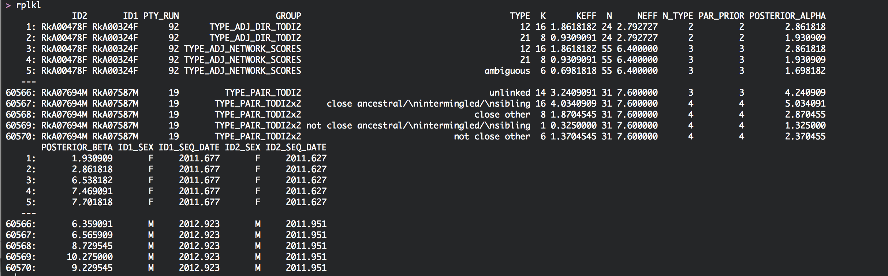
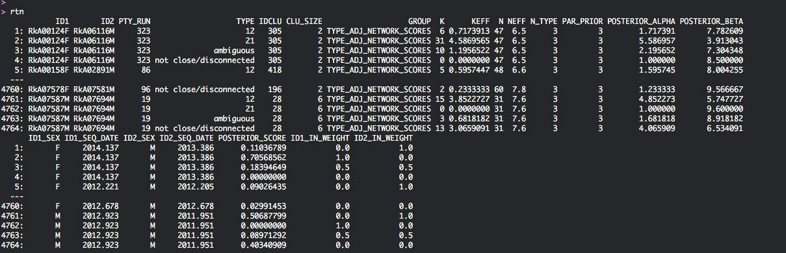
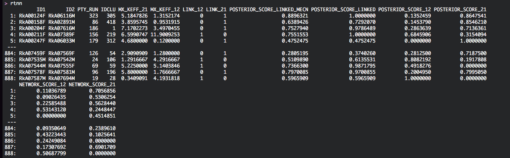
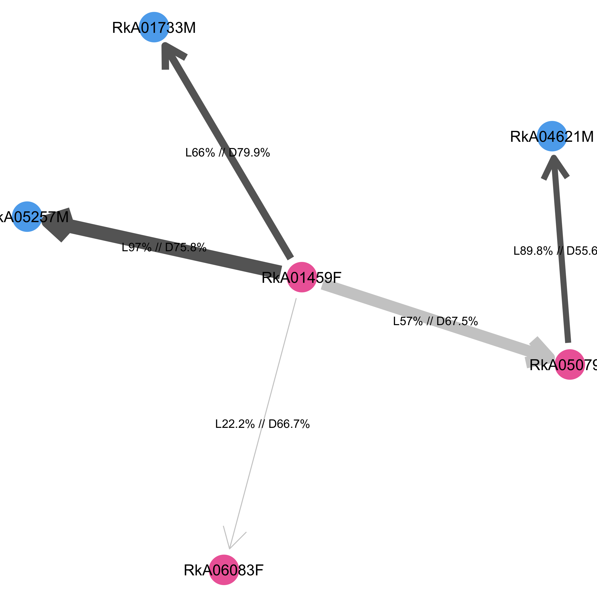

```{r setup, include = FALSE}
knitr::opts_chunk$set(
  collapse = TRUE,
  comment = "#>"
)
``` 

## Introduction
[In the previous tutorial](Rakai.01.run_phyloscanner.html), we performed *phyloscanner* analyses to reconstruct phylogenetic relationships between individuals that together form a potential transmission network. The analysis proceeded in batches, in which each transmission network was given a batch number, and small networks were combined into a single batch. Each batch was identified by the prefix `ptyrX_` where `X` is the batch number. 

**In this tutorial, we will take a look at the output.** We will:
1. Collect pairs of individuals between whom phylogenetic linkage cannot be excluded based on the distance and topological relationship of viral reads from both individuals. 
2. Reconstruct transmission networks from these pairs. Unlike typical phylogenetic clusters, the transmission networks that we reconstruct from deep-sequence data contain information into the direction of transmission. 

## Setting up the analysis
[In the previous tutorial](Rakai.01.run_phyloscanner.html), we generated a large number of files, including `ptyrX_pairwise_relationships.rda`. We will need only these files to reconstruct HIV-1 transmission networks. 

To be safe, it might be a good idea to copy them into a new directory. I copied them to the following analysis directory, and all further output will be stored in the same directory:
```{r, include=TRUE, eval=FALSE, echo=TRUE, tidy=TRUE}
HOME <- '/Users/Oliver/Dropbox (SPH Imperial College)/2015_PANGEA_DualPairsFromFastQIVA'
indir <- file.path(HOME, 'RakaiPopSample_phyloscanner_analysis')
outdir <- indir
outfile.base <- file.path(outdir,'phsc_analysis_of_dataset_S1')
neff.cut <- 3
conf.cut <- 0.6		 
```
 
## Find all pairs of individuals between whom linkage cannot be excluded
The following code snippet processes all pairwise phylogenetic relationships that were reconstructed with *phyloscanner* [in the previous tutorial](Rakai.01.run_phyloscanner.html), and returns a data.table that contains all pairs of individuals between whom phylogenetic linkage is not excluded based on distance and adjacency. There are three input arguments: 
1. `batch.regex` identifies the batch number from the file names of *phyloscanner* output; 
2. `neff.cut`  specifies the minimum number of deep-sequence phylogenies with sufficient reads from two individuals in order to make any phylogenetic inferences (default is 3); 
3. `conf.cut` specifies the proportion of deep-sequence phylogenies with distant/disconnected subgraphs above which pairs are considered phylogenetically unlinked (default is 60%).

At this stage, it is also easy to add any further individual-level meta-data to the analysis output. Simply specify a data.table to the `dmeta` input variable. 

For the analysis of the Rakai population-based sample:
```{r, include=TRUE, eval=FALSE, echo=TRUE, tidy=TRUE}
infile <- "~/Dropbox (SPH Imperial College)/2017_phyloscanner_validation/Supp_Data/Data_Set_S2.csv"
dmeta <- as.data.table(read.csv(infile, stringsAsFactors=FALSE))
tmp <- phsc.find.linked.pairs(indir, batch.regex='^ptyr([0-9]+)_.*', conf.cut=0.6, neff.cut=3, verbose=TRUE, dmeta=dmeta)
rtp <- copy(tmp$linked.pairs)
rpw <- copy(tmp$windows)
rplkl <- copy(tmp$relationship.counts)
```

On the *phyloscanner* output of the Rakai population-based sample, this will produce the following output (when `verbose=TRUE`):
```text
Found phylogenetic relationship files, n= 345
Processing...
Found (potentially duplicate) pairs between whom linkage is not excluded phylogenetically, n= 1705
Collect phylogenetic relationship counts for each pair...
Collect basic phyloscanner statistics (distance, adjacency, paths between subgraphs) for each pair...
Re-arrange pairs so that ID1<ID2...
If pairs are in several batches, select batch with most deep-sequence phylogenies...
Left with pairs between whom linkage is not excluded phylogenetically, n= 1326
Add meta-data...
Done. Found pairs, n= 1251 . Found relationship counts, n= 60570 . Found phyloscanner statistics, n= 1076768 .
```

Let us save the output, and then take a closer look:
```{r, include=TRUE, eval=FALSE, echo=TRUE, tidy=TRUE}
save(rtp, rplkl, rpw, file=paste0(outfile.base,'_allpairs.rda'))	 
```

## *phyloscanner* statistics for each window
The data.table `rpw` describes for each pair (`ID1`, `ID2`) the basic *phyloscanner* statistics (patristic distance, adjacency, contiguity, paths from subgraphs of individual 1 to subgraphs of individual 2, and vice versa) across the genome, plus any meta-data that was potentially added: 
 
<p align="center"></p>

In addition, `rpw` describes how the phylogenetic relationship of the two individuals is classified in each genomic window. There are several classifications: 
1. The most important one is probably `GROUP=='TYPE_ADJ_NETWORK_SCORES'`. In each genomic window, pairs are classified as either '12' (subgraphs of individual 1 are close, adjacent and ancestral to those from individual 2), '21' (subgraphs of individual 2 are close, adjacent and ancestral to those from individual 1), 'ambiguous' (subgraphs are close, adjacent and either intermingled or sibling), or 'not close/disconnected' (subgraphs are either not close, or not adjacent).
2. There are two more important classification types. The relationship types that support phylogenetic linkage are '12', '21', and 'ambiguous'. In the classification `GROUP=='TYPE_CHAIN_TODI'` these three states are already summarised to state 'chain'. 
3. Finally, the classification `GROUP=='TYPE_ADJ_DIR_TODI2'` only considers genomic windows with phylogenetic support into the direction of transmission. The possible states are either '12', '21', and all other genomic windows are assigned NA.     

We can visualise the phylogenetic relationships between two individuals across the genome with the function `phsc.plot.phyloscan`:	
```{r, include=TRUE, eval=FALSE, echo=TRUE, tidy=TRUE}
rpw2 <- subset(rpw, ID1=='RkA04565F' & ID2=='RkA05315F')		
p	<- phsc.plot.phyloscan(rpw2)
p
ggsave(file=paste0(outfile.base,'_phyloscan_RkA04565F_RkA05315F.png'), width=6, height=2.8, units='in', dpi=400)
```	
<p align="center"></p>

The plot shows the phylogenetic relationship between the two females *RkA04565F* *RkA05315F* across 55 overlapping deep-sequence trees on reads that cover the *gag* gene. The start position of each 250bp genomic window is plotted on the x-axis. The genetic distance between the subgraphs of both females are shown on the y-axis: the two females have nearly identical virus in all trees. The topological relationship of the subgraphs of the two females is indicated in colours: the two females have intermingled virus across nearly all deep-sequence phylogenies. Since HIV is extremely rarely transmitter between women, the important conclusion is that even when virus is heavily intermingled and nearly identical, it is not possible to prove that transmission occurred between the corresponding two individuals. One more thing: the same function can also be used on a large number of pairs.   

## Relationship counts for each pair
The data.table `rplkl` is a summary of the information in `rpw` for each genomic window, and gives for each pair the counts of how often certain phylogenetic relationships were seen across the genome. 
1. For each pair, column `N` gives the total number of deep-sequence phylogenies in which both individuals had sufficient reads for phylogenetic analysis.
2. Column `TYPE` gives a particular phylogenetic relationship type, for example '12', and column `K` gives the number of deep-sequence phylogenies in whom the subgraphs of both individuals were of that type.
3. Colums `NEFF` and `KEFF` are similar to `N` and `K`, but adjust for potential overlap in read alignments.
     
Here is a screenshot of data.table `rplkl` for the *phyloscanner* analysis of the Rakai population-based sample:   
<p align="center"></p>


## Reconstructing transmission networks among individuals between whom phylogenetic linkage cannot be excluded
We can now reconstruct transmission networks simply by connecting pairs of linked individuals that have one individual in common with the function `phsc.find.transmission.networks.from.linked.pairs`: 
```{r, include=TRUE, eval=FALSE, echo=TRUE, tidy=TRUE}
tmp <- phsc.find.transmission.networks.from.linked.pairs(rtp, rplkl, conf.cut=conf.cut, neff.cut=neff.cut, verbose=TRUE)
rtn <- copy(tmp$transmission.networks)
rtnn <- copy(tmp$most.likely.transmission.chains)		
save(rtn, rtnn, file=paste0(outfile.base,'_allnetworks.rda'))
```
On the *phyloscanner* output of the Rakai population-based sample, this will produce the following output (when `verbose=TRUE`):
```text
Reconstruct transmission networks among linked pairs, n= 1191
Found transmission networks, n= 446 . Number of links (either direction and ambiguous)= 1191 . Number of individuals= 1339 .
Reconstruct most likely transmission chains...
Found most likely transmission chains, n= 446 . Number of links= 888 . Number of individuals= 1334 .
Done.
```
The data.table `rtn` lists the linked pairs (`ID1`,`ID2`) and how they are connected in transmission networks. Each network is given a unique identifier, which is listed in column `IDCLU`. The number of individuals in each transmission network is given in column `CLU_SIZE`. Finally, the data.table also provides information on the phylogenetic support for each of the phylogenetic relationship types '12', '21', 'ambiguous', and 'not close/disconnected':   
<p align="center"></p>

We can visualise each transmission network with the function `phsc.plot.transmission.network`: 
```{r, include=TRUE, eval=FALSE, echo=TRUE, tidy=TRUE}
idclus <- sort(unique(rtn$IDCLU))
di <- copy(dmeta)									
df <- subset(rtn, IDCLU==34)
set(df, NULL, c('ID1_SEX','ID2_SEX'), NULL)
p <- phsc.plot.transmission.network(df, di, point.size=10, 
			edge.gap=0.04, 
			edge.size=0.4, 
			curvature= -0.2, 
			arrow=arrow(length=unit(0.04, "npc"), type="open"), 
			curv.shift=0.06, 
			label.size=3, 
			node.label='ID', 			 
			node.fill='SEX', 
			node.shape.values=c('NA'=16), 
			node.fill.values=c('F'='hotpink2', 'M'='steelblue2'),
			threshold.linked=0.6)	
png(file=paste0(outfile.base,'_trmnetwork_34.png'), width=6, height=6, units='in', res=400)		
print(p)
dev.off()
```
<p align="center"></p>

In this plot, directed arrows with labels are drawn to indicate the phylogenetic support for transmission in the 1->2 or 2->1 direction (states '12' and '21' in `rtn`). An undirected labelled edge is drawn to indicate any additional phylogenetic support that the two individuals are linked even though the direction of transmission could not be determined (state 'ambiguous' in `rtn`). The labels indicate the proportion of deep-sequence phylogenies that support each relationship state, after adjusting for overlap in read alignments. Edges between pairs of individuals are highlighted in dark grey for pairs who have phylogenetic support for linkage above the threshold `threshold.linked`. 

It is possible to highlight different individual-level variables in `dmeta` on the network by *shape* and *colour*, by setting the input arguments `node.label`, `node.fill`, `node.shape` and `node.fill.values`, `node.shape.values`. Just try it out! Also not that, to obtain nicely looking plots, I typically have to adjust the plotting parameters for networks of different sizes.

## Identifying the most likely transmission chain for each transmission network
As expected given the uncertainty in our inferences, the reconstructed transmission networks typically include cycles of possible transmission flows and recipients with more than one probable source case, indicating that multiple transmission chains are consistent with the phylogenetic data. [We can apply Edmonds algorithm](https://en.wikipedia.org/wiki/Edmonds%27_algorithm) to solve for the most likely transmission chain, which corresponds to the transmission flow with the largest product of weights (the labels) along directed edges that connects all individuals, subject to the constraint that there are no circles and that each individual has one incoming edge. This is already done as part of the function `phsc.find.transmission.networks.from.linked.pairs`.

The data.table `rtnn` lists as before the linked pairs (`ID1`,`ID2`) along with the transmission network that they belong to (`IDCLU`). The data.table contains two new columns, `LINK_12` and `LINK_21`, that describe if the most likely transmission chain passes through individuals 1 and 2, and in which direction. Here is a screenshot of data.table `rtnn` for the phyloscanner analysis of the Rakai population-based sample: 
<p align="center"></p>

We can visualise the most likely transmission chains with the function `phsc.plot.most.likely.transmission.chain`:
```{r, include=TRUE, eval=FALSE, echo=TRUE, tidy=TRUE}
layout	<- p$layout 
di		<- copy(dmeta)									
df		<- subset(rtnn, IDCLU==34)	
p2		<- phsc.plot.most.likely.transmission.chain(df, di, point.size=10, 
			edge.gap=0.04, 
			edge.size=0.4, 
			curvature= -0.2, 
			arrow=arrow(length=unit(0.04, "npc"), type="open"), 
			curv.shift=0.06, 
			label.size=3, 
			node.label='ID', 			 
			node.fill='SEX', 
			node.shape.values=c('NA'=16), 
			node.fill.values=c('F'='hotpink2', 'M'='steelblue2'),
			threshold.linked=0.6,
			layout=layout)	
png(file=paste0(outfile.base,'_trmchain_34.png'), width=6, height=6, units='in', res=400)		
print(p2)
dev.off()
```
<p align="center"></p>

In this plot, the most likely transmission chain starts at female *RkA01459F* and continues to four individuals. The phylogenetic support for two linkages from *RkA01459F* to males *RkA05257M*, *RkA01733M* is high, with more than 60% of deep-sequence phylogenies supporting linkage. The precise support for linkage is given in the label (after L), and the support for the direction of transmission among all deep-sequence phylogenies with information on directionality is also indicated (after D). One link to female *RkA06083F* has weak support, and the two females have intermediates distances between 2.5%-5% in most deep-sequence phylogenies. The last link to female *RkA05079* is more strongly supported, although the two females have phylogenetically close and adjacent virus in less than 60% of deep-sequence phylogenies.


As before, it is possible to highlight different individual-level variables in `dmeta` on the network by *shape* and *colour*, by setting the input arguments `node.label`, `node.fill`, `node.shape` and `node.fill.values`, `node.shape.values`. We can preserve the same positioning of the individuals as in the plot of the corresponding transmission network with the `layout` argument.
