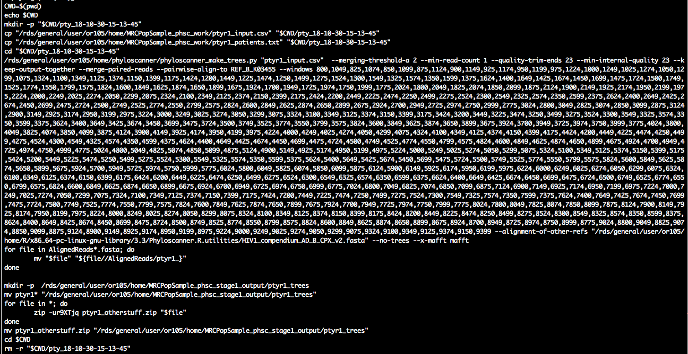

```{r setup, include = FALSE}
knitr::opts_chunk$set(
  collapse = TRUE,
  comment = "#>"
)
```

## Introduction
This tutorial describes how to identify phylogenetically closely related
individuals with *phyloscanner* from of a large population-based sample of deep
sequences. 

## Setting up the analysis
Let us define input and output directories for our analysis in R.
```{r, include=TRUE, eval=FALSE, echo=TRUE, tidy=TRUE}
require(Phyloscanner.R.utilities)
HOME			<<- '/rds/general/project/ratmann_pangea_analyses_mrc_uvri/live'
data.dir		<- '/rds/general/project/ratmann_pangea_deepsequencedata/live/PANGEA2_MRC'
prog.pty		<- '/rds/general/user/or105/home/phyloscanner/phyloscanner_make_trees.py'
in.dir		<- file.path(HOME,'MRCPopSample_phsc_stage1_input')		
work.dir	<- file.path(HOME,"MRCPopSample_phsc_work")
out.dir		<- file.path(HOME,"MRCPopSample_phsc_stage1_output")	
dir.create(in.dir, showWarnings=FALSE)
dir.create(out.dir, showWarnings=FALSE)
dir.create(work.dir, showWarnings=FALSE)
```
Here, `prog.pty` is the full path to the *phyloscanner*
program *phyloscanner_make_trees.py* and `work.dir` is the name of a temporary
directory. Do make sure that the directory names above do not start with "~", because 
the names are not expanded in the scripts below. White space, or characters like '-' are OK.

## Setting up *phyloscanner* runs to test the phylogenetic relationship of all possible pairs of individuals
Next, we define a large number of *phyloscanner* runs to test the phylogenetic
relationship of all possible pairs of individuals. We start by
generating a list of all bam files in our data directory (`data.dir`), and then
we identify the corresponding individuals with a regular expression:
```{r, include=TRUE, eval=FALSE, echo=TRUE, tidy=TRUE}
dbam	<- data.table(BAM=list.files(data.dir, pattern='.*remap\\.bam$',full.names=FALSE, recursive=TRUE))
regex.person	<- '^([A-Z0-9]+-[A-Z0-9]+)-.*$'
dbam[, IND:= gsub(regex.person,'\\1',BAM)]
```
The data.table `dbam` should look similar to the following:
<p align="center"></p>

We then group individuals for phyloscanner analyses, so that
phylogenetic linkage between every pair of individuals is assessed at least
once. Specifically, individuals are grouped into batches of specified size,
and then, all possible pairs of batches are formed. Each of these pairs of
batches defines a group of individuals between whom phylogenetic linkages are
assessed in one phyloscanner run. Thus, the number of individuals in each group
is twice the batch size: 

```{r, include=TRUE, eval=FALSE, echo=TRUE, tidy=TRUE}
tmp	<- unique(dbam$IND)
pty.runs<- phsc.define.stage1.analyses(tmp, batch.size=50)
#	add BAM files per individual
pty.runs<- merge(pty.runs, subset(dbam, select=c(IND, BAM)), by='IND', allow.cartesian=TRUE)
setkey(pty.runs, PTY_RUN)
#	save to file
outfile	<- 'phsc_runs_MRC_stage1_n2531_181026.csv'
write.csv(pty.runs, file=file.path(in.dir,outfile), row.names=FALSE)
```
The data.table `pty.runs` should look similar to the following:
<p align="center"></p>

The data.table specifies a large number of *phyloscanner* runs.
All individuals ('IND') are grouped in batches ('BATCH'), and two batches are
paired to evaluate the phylogenetic relationship of the associated individuals
in a particular analysis ('PTY_RUN'). 

## Prepare bash scripts to generate read alignments
The next step is to define the input arguments generate read alignments with
*phyloscanner*. Please see the *phyloscanner* manual for details. The default
arguments that were used for analysis of the Rakai population-based sample are
as follows. 
```{r, include=TRUE, eval=FALSE, echo=TRUE, tidy=TRUE}
pty.select			<- 1:2	#for demo purposes, we select the first two runs. Set to NA.
pty.args			<- list(	prog.pty=prog.pty, 
		prog.mafft='mafft',  
		data.dir=data.dir, 
		work.dir=work.dir, 
		out.dir=out.dir, 
		alignments.file=system.file(package="Phyloscanner.R.utilities", "HIV1_compendium_AD_B_CPX_v2.fasta"),
		alignments.root='REF_CPX_AF460972', 
		alignments.pairwise.to='REF_B_K03455',
		window.automatic='', 
		merge.threshold=2, 
		min.read.count=1, 
		quality.trim.ends=23, 
		min.internal.quality=23, 
		merge.paired.reads=TRUE, 
		no.trees=TRUE, 
		dont.check.duplicates=FALSE,
		dont.check.recombination=TRUE,
		win=c(800,9400,25,250),				 				
		keep.overhangs=FALSE,
		mem.save=0,
		verbose=TRUE,					
		select=pty.select	#of 240
)	
save(pty.args, file=file.path(in.dir, 'phsc_args_stage1_create_read_alignments.rda'))
```

Next, we will prepare UNIX bash scripts to process the data in parallel. Each
bash script will consist of UNIX commands to generate alignments of
deep-sequence viral reads for one phyloscanner run
('PTY_RUN'). All scripts, and hence all runs can be performed in parallel. Each
alignment contains viral reads of the individuals in one run, and all reads
overlap a particular genomic window of the HIV-1 genome:  
```{r, include=TRUE, eval=FALSE, echo=TRUE, tidy=TRUE}
#	check which (if any) batches have already been processed, and remove from TODO list	
tmp			<- data.table(FILE_FASTA=list.files(out.dir, pattern='^ptyr[0-9]+_', full.names=TRUE))
tmp[, PTY_RUN:= as.integer(gsub('ptyr([0-9]+)_.*','\\1',basename(FILE_FASTA)))]
pty.runs	<- merge(pty.runs, tmp, by='PTY_RUN', all.x=1)
pty.runs	<- subset(pty.runs, is.na(FILE_FASTA))
#	search for bam files and references and merge with runs
pty.runs	<- subset(pty.runs, select=c(PTY_RUN, IND))	
tmp			<- phsc.find.bam.and.references(pty.args[['data.dir']], regex.person='^([A-Z0-9]+-[A-Z0-9]+)-.*$')	
pty.runs	<- merge(pty.runs, tmp, by='IND')
#	create UNIX bash scripts
pty.runs	<- pty.runs[, list(BAM=BAM, REF=REF, SAMPLE=SAMPLE, RENAME_ID=paste0(IND,'-fq',seq_len(length(BAM)))), by=c('PTY_RUN','IND')]
setkey(pty.runs, PTY_RUN)		
setnames(pty.runs, c('IND','SAMPLE'), c('UNIT_ID','SAMPLE_ID'))
pty.c		<- phsc.cmd.phyloscanner.multi(pty.runs, pty.args)
pty.c[, CASE_ID:= seq_len(nrow(pty.c))]
```

Let us take a look at the first batch script:
```{r, include=TRUE, eval=FALSE, echo=TRUE, tidy=TRUE}
pty.c[1,cat(CMD)]
```
<p align="center"></p>

We see the familiar call to `phyloscanner_make_trees.py`, and we suppressed
tree reconstruction with the input command `--no-trees`. There is also a bit of
file copying before/after. This ensures that the script is self-contained,
and that it operates on a local directory in case the data are stored on a
central data storage system.

## Run bash scripts to generate read alignments

The next task is submit the bash scripts to a job scheduling system on a high
performance computing environment. We first define a PBS header for the job
scheduling system, add the header to each script, and then submit each script to
the job scheduling system. The exact form of the PBS header depends on your job
scheduler, below is an example that works at Imperial.

```{r, include=TRUE, eval=FALSE, echo=TRUE, tidy=TRUE}
hpc.load <- "module load R/3.3.3"			# make R available 
hpc.select <- 1						# number of nodes
hpc.nproc <- 1						# number of processors on node
hpc.walltime <- 15					# walltime
hpc.q <- "pqeelab"					# PBS queue
hpc.mem <- "6gb" 					# RAM
hpc.array			<- pty.c[, max(CASE_ID)]	# number of runs for job array	
#	define PBS header for job scheduler. this will depend on your job scheduler.
pbshead		<- "#!/bin/sh"
tmp			<- paste("#PBS -l walltime=", hpc.walltime, ":59:00,pcput=", hpc.walltime, ":45:00", sep = "")
pbshead		<- paste(pbshead, tmp, sep = "\n")
tmp			<- paste("#PBS -l select=", hpc.select, ":ncpus=", hpc.nproc,":mem=", hpc.mem, sep = "")
pbshead 	<- paste(pbshead, tmp, sep = "\n")
pbshead 	<- paste(pbshead, "#PBS -j oe", sep = "\n")	
if(!is.na(hpc.array))
	pbshead	<- paste(pbshead, "\n#PBS -J 1-", hpc.array, sep='')	
if(!is.na(hpc.q)) 
	pbshead <- paste(pbshead, paste("#PBS -q", hpc.q), sep = "\n")
pbshead 	<- paste(pbshead, hpc.load, sep = "\n")	
```

Our header thus looks as follows:	
```bash
#!/bin/sh
#PBS -l walltime=71:59:00,pcput=71:45:00
#PBS -l select=1:ncpus=1:mem=6gb
#PBS -j oe
#PBS -J 1-2
#PBS -q pqeelab
module load intel-suite/2015.1 mpi raxml/8.2.9 mafft/7 anaconda/2.3.0 samtools
```
	
We are now ready to create an array script, and submit the array job:		
```{r, include=TRUE, eval=FALSE, echo=TRUE, tidy=TRUE}
#	create PBS job array
cmd		<- pty.c[, list(CASE=paste0(CASE_ID,')\n',CMD,';;\n')), by='CASE_ID']
cmd		<- cmd[, paste0('case $PBS_ARRAY_INDEX in\n',paste0(CASE, collapse=''),'esac')]			
cmd		<- paste(pbshead,cmd,sep='\n')	
#	submit job
outfile		<- gsub(':','',paste("readali",paste(strsplit(date(),split=' ')[[1]],collapse='_',sep=''),'sh',sep='.'))
outfile		<- file.path(pty.args[['work.dir']], outfile)
cat(cmd, file=outfile)
cmd 		<- paste("qsub", outfile)
cat(cmd)
cat(system(cmd, intern= TRUE))	
```

## Prepare bash scripts to reconstruct deep-sequence trees
As soon as the first read alignments are generated, we can plough ahead and
reconstruct viral phylogenies. There is no need to wait until all alignments
have been generated. Because we are considering highly overlapping genomic
windows across the genome, we will reconstruct one tree per genomic window. The
resulting trees across the genome capture not only uncertainty in tree
reconstruction, but also differences in viral evolution across the genome,
differences in read amplification and mapping, and uncertainty in alignment
construction. This is why we prefer to reconstruct trees from overlapping
windows, rather than bootstrap trees or samples of posterior tree distributions
for a few genomic windows.

We will add the trees to the directory in which the read alignments are, so let
us re-set the input directory:
```{r, include=TRUE, eval=FALSE, echo=TRUE, tidy=TRUE}
in.dir			<- file.path(HOME,'MRCPopSample_phsc_stage1_output')
```

Next, we search for read alignments, and check that the corresponding trees
have not yet been generated:
```{r, include=TRUE, eval=FALSE, echo=TRUE, tidy=TRUE}
#	search for read alignments
infiles	<- data.table(FI=list.files(in.dir, pattern='fasta$', full.names=TRUE, recursive=TRUE))
infiles[, FO:= gsub('fasta$','tree',FI)]
infiles[, PTY_RUN:= as.integer(gsub('^ptyr([0-9]+)_.*','\\1',basename(FI)))]
infiles[, W_FROM:= as.integer(gsub('.*InWindow_([0-9]+)_.*','\\1',basename(FI)))]
#	check which (if any) trees have already been processed, and remove from TODO list
tmp		<- data.table(FT=list.files(out.dir, pattern='^ptyr.*tree$', full.names=TRUE, recursive=TRUE))
tmp[, PTY_RUN:= as.integer(gsub('^ptyr([0-9]+)_.*','\\1',basename(FT)))]
tmp[, W_FROM:= as.integer(gsub('.*InWindow_([0-9]+)_.*','\\1',basename(FT)))]
infiles	<- merge(infiles, tmp, by=c('PTY_RUN','W_FROM'), all.x=1)
infiles	<- subset(infiles, is.na(FT))	
```

The read alignments can differ substantially in size, so we expect that the
time and memory requirements to generate phylogenies also differ. We will do
the easy jobs first, and leave the really big phylogenies that we may want to
reconstruct with multiple cpu cores and a lot of RAM until the very end.
With this strategy in mind, we order the alignments by the number of reads
in each, and associate a 'CASE_ID' to each alignment:   
```{r, include=TRUE, eval=FALSE, echo=TRUE, tidy=TRUE}
tmp		<- infiles[, list(N_TAXA=as.integer(system(paste0('grep -c "^>" ', FI), intern=TRUE))), by=c('FI')]
infiles	<- merge(infiles, tmp, by='FI')
infiles	<- infiles[order(N_TAXA),]
infiles[, CASE_ID:= seq_len(nrow(infiles))]
setkey(infiles, CASE_ID)
```

Let us take a look at the files to be processed for just one run (in our case,
run 100): 
<p align="center"></p>

The smallest alignment has 194 reads, which is the alignment of the genomic
window that starts at position 4750 of the HXB2 reference genome. The largest
alignment has 2377 reads, and corresponds to the genomic window that starts at
position 1800 of the HXB2 reference genome.


As before, we will generate UNIX *bash* scripts to reconstruct trees in
parallel, and submit each job to a job scheduler of a high-performance
computing system. This time though, we will start with the job specification
because the RAxML command specification depends on the job specification. For
small read alignments, a single processor will do. Keep in mind that for large
alignments, you likely want to change the following job specification.

```{r, include=TRUE, eval=FALSE, echo=TRUE, tidy=TRUE} 
infiles				<- subset(infiles, CASE_ID<=1e4)
hpc.load			<- "module load intel-suite/2015.1 mpi raxml/8.2.9"	# make third party requirements available	 
hpc.select			<- 1						# number of nodes
hpc.nproc			<- 1						# number of processors on node
hpc.walltime		<- 71						# walltime
hpc.q				<- NA						# PBS queue
hpc.mem				<- "2gb" 					# RAM	
hpc.array			<- infiles[, max(CASE_ID)]	# number of runs for job array	
#	define PBS header for job scheduler. this will depend on your job scheduler.
pbshead		<- "#!/bin/sh"
tmp			<- paste("#PBS -l walltime=", hpc.walltime, ":59:00,pcput=", hpc.walltime, ":45:00", sep = "")
pbshead		<- paste(pbshead, tmp, sep = "\n")
tmp			<- paste("#PBS -l select=", hpc.select, ":ncpus=", hpc.nproc,":mem=", hpc.mem, sep = "")
pbshead 	<- paste(pbshead, tmp, sep = "\n")
pbshead 	<- paste(pbshead, "#PBS -j oe", sep = "\n")	
if(!is.na(hpc.array))
	pbshead	<- paste(pbshead, "\n#PBS -J 1-", hpc.array, sep='')	
if(!is.na(hpc.q)) 
	pbshead <- paste(pbshead, paste("#PBS -q", hpc.q), sep = "\n")
pbshead 	<- paste(pbshead, hpc.load, sep = "\n")
```

Depending on the job spec, we define the RAxML command and RAxML arguments:
```{r, include=TRUE, eval=FALSE, echo=TRUE, tidy=TRUE}
#raxml.pr	<- ifelse(hpc.nproc==1, 'raxmlHPC-AVX','raxmlHPC-PTHREADS-AVX')		#on newer machines with AVX instructions
raxml.pr	<- ifelse(hpc.nproc==1, 'raxmlHPC-SSE3', 'raxmlHPC-PTHREADS-SSE3')	#on older machines without AVX instructions
raxml.args	<- ifelse(hpc.nproc==1, '-m GTRCAT --HKY85 -p 42 -o REF_B_K03455', paste0('-m GTRCAT --HKY85 -T ',hpc.nproc,' -p 42 -o REF_B_K03455'))
```

Finally, we prepare the UNIX *bash* scripts to generate a maximum-likelihood
deep-sequecen tree for each read alignment:
```{r, include=TRUE, eval=FALSE, echo=TRUE, tidy=TRUE} 
pty.c	<- infiles[, list(CMD=raxml.cmd(FI, outfile=FO, pr=raxml.pr, pr.args=raxml.args)), by=c('CASE_ID')]
```

Let us have a look at the commands in one script:
```{r, include=TRUE, eval=FALSE, echo=TRUE, tidy=TRUE}
pty.c[1,cat(CMD)]
```
<p align="center"></p>

In about the middle of the script, we see a call to RAxML, great. As before,
this is encapsulated by file management commands to ensure that the script is
self-contained, and that the script operates on a local directory in case the
data are stored on a central data storage system.

## Run bash scripts to reconstruct deep-sequence trees
The final task is to submit the *bash* scripts to a job scheduler of a
high-performance computing system:
```{r, include=TRUE, eval=FALSE, echo=TRUE, tidy=TRUE}
#	make array job
cmd		<- pty.c[, list(CASE=paste0(CASE_ID,')\n',CMD,';;\n')), by='CASE_ID']
cmd		<- cmd[, paste0('case $PBS_ARRAY_INDEX in\n',paste0(CASE, collapse=''),'esac')]			
cmd		<- paste(pbshead,cmd,sep='\n')	
#	submit job
outfile		<- gsub(':','',paste("trs",paste(strsplit(date(),split=' ')[[1]],collapse='_',sep=''),'sh',sep='.'))
outfile		<- file.path(work.dir, outfile)
cat(cmd, file=outfile)
cmd 		<- paste("qsub", outfile)
cat(cmd)
cat(system(cmd, intern= TRUE))	
```

This time, the job array script is very large with up to 10,000 jobs. It should
look similar to the following, which highlights jobs 312 and 313:
<p align="center"></p>


Remember that we generate 10,000 trees for the smallest read alignments
with one array job, so we need to repeat the above steps several times. The
limit of 10,000 was chosen so that the job array file does not get too large.
Also, once you get to really large read alignments, you will likely want to
change to run RAxML with multiple cores and more RAM.